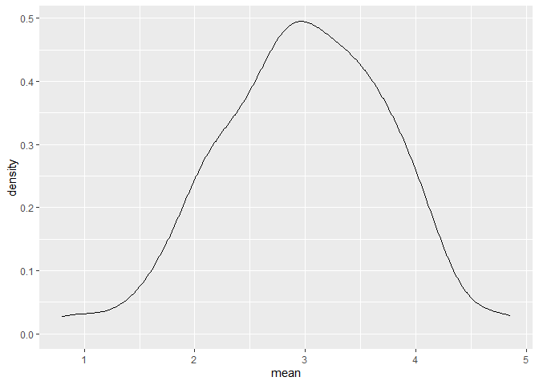
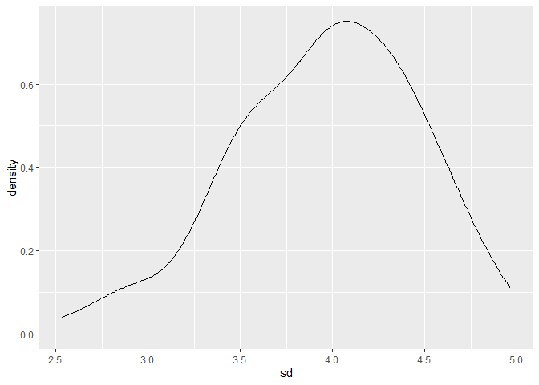
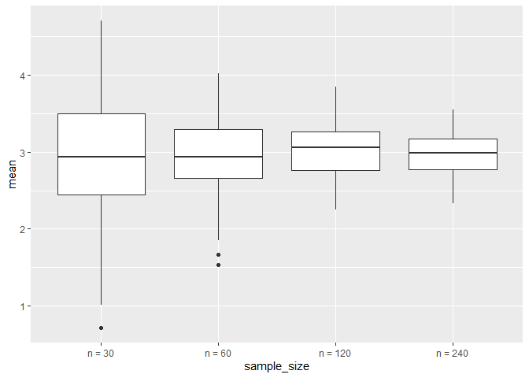
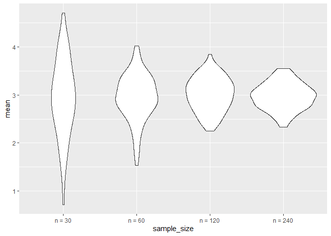

simulation
================
Yuchen Hua
2022-11-06

## Let’s simulation something

``` r
sim_mean_sd = function(samp_size, mu = 3, sigma = 4) {
  
  sim_data = tibble(
    x = rnorm(n = samp_size, mean = mu, sd = sigma),
  )
  
  sim_data %>% 
    summarize(
      mean = mean(x),
      sd = sd(x)
    )
}
```

I can simulate by running this line

``` r
sim_mean_sd(30)
```

    ## # A tibble: 1 × 2
    ##    mean    sd
    ##   <dbl> <dbl>
    ## 1  3.33  3.70

## I can simulate a lot

``` r
output = vector("list", length = 100)

for(i in 1:100) {
  output[[i]] = sim_mean_sd(samp_size = 30)
}

bind_rows(output)
```

    ## # A tibble: 100 × 2
    ##     mean    sd
    ##    <dbl> <dbl>
    ##  1  3.53  3.18
    ##  2  3.44  3.84
    ##  3  3.45  3.53
    ##  4  1.68  3.69
    ##  5  3.95  4.22
    ##  6  3.27  4.34
    ##  7  2.05  4.05
    ##  8  3.10  3.72
    ##  9  3.55  4.11
    ## 10  3.87  3.79
    ## # … with 90 more rows

Let’s use a loop function.

``` r
sim_result = 
  rerun(100, sim_mean_sd(samp_size = 30)) %>%
  bind_rows()
```

Let’s look at results…

``` r
sim_result %>%
  ggplot(aes(x = mean)) + geom_density()
```

<!-- -->

``` r
sim_result %>%
  summarize(
    avg_samp_mean = mean(mean),
    sd_samp_mean = sd(mean)
  )
```

    ## # A tibble: 1 × 2
    ##   avg_samp_mean sd_samp_mean
    ##           <dbl>        <dbl>
    ## 1          2.98        0.756

``` r
sim_result %>%
  ggplot(aes(x=sd))+geom_density()
```

<!-- -->

## Let’s try other sample size.

``` r
n_list = 
  list(
    "n=30" = 30,
    "n =60" = 60,
    "n=120"=120,
    "n=240"=240
  )

output = vector("list", length = 4)

output[[1]] = rerun(100, sim_mean_sd(samp_size = n_list[[1]])) %>% bind_rows()
output[[2]] = rerun(100, sim_mean_sd(samp_size = n_list[[1]])) %>% bind_rows()

for(i in 1:4) {
  output[[i]] = 
    rerun(100, sim_mean_sd(samp_size = n_list[[i]]))%>%
    bind_rows()
}
```

``` r
tibble(
  sample_size = c(30, 60, 120, 240)
)%>%
  mutate(
    output_lists = map(.x = sample_size, ~ rerun(100, sim_mean_sd(.x))),
  ) %>% pull(output_lists)
```

    ## [[1]]
    ## [[1]][[1]]
    ## # A tibble: 1 × 2
    ##    mean    sd
    ##   <dbl> <dbl>
    ## 1  1.61  4.22
    ## 
    ## [[1]][[2]]
    ## # A tibble: 1 × 2
    ##    mean    sd
    ##   <dbl> <dbl>
    ## 1  3.93  4.16
    ## 
    ## [[1]][[3]]
    ## # A tibble: 1 × 2
    ##    mean    sd
    ##   <dbl> <dbl>
    ## 1  4.57  5.06
    ## 
    ## [[1]][[4]]
    ## # A tibble: 1 × 2
    ##    mean    sd
    ##   <dbl> <dbl>
    ## 1  1.76  4.49
    ## 
    ## [[1]][[5]]
    ## # A tibble: 1 × 2
    ##    mean    sd
    ##   <dbl> <dbl>
    ## 1  2.14  3.48
    ## 
    ## [[1]][[6]]
    ## # A tibble: 1 × 2
    ##    mean    sd
    ##   <dbl> <dbl>
    ## 1  2.14  3.42
    ## 
    ## [[1]][[7]]
    ## # A tibble: 1 × 2
    ##    mean    sd
    ##   <dbl> <dbl>
    ## 1  2.40  4.12
    ## 
    ## [[1]][[8]]
    ## # A tibble: 1 × 2
    ##    mean    sd
    ##   <dbl> <dbl>
    ## 1  3.39  3.80
    ## 
    ## [[1]][[9]]
    ## # A tibble: 1 × 2
    ##    mean    sd
    ##   <dbl> <dbl>
    ## 1  2.97  3.78
    ## 
    ## [[1]][[10]]
    ## # A tibble: 1 × 2
    ##    mean    sd
    ##   <dbl> <dbl>
    ## 1  3.41  4.35
    ## 
    ## [[1]][[11]]
    ## # A tibble: 1 × 2
    ##    mean    sd
    ##   <dbl> <dbl>
    ## 1  4.03  3.96
    ## 
    ## [[1]][[12]]
    ## # A tibble: 1 × 2
    ##    mean    sd
    ##   <dbl> <dbl>
    ## 1  2.81  4.01
    ## 
    ## [[1]][[13]]
    ## # A tibble: 1 × 2
    ##    mean    sd
    ##   <dbl> <dbl>
    ## 1  3.45  3.10
    ## 
    ## [[1]][[14]]
    ## # A tibble: 1 × 2
    ##    mean    sd
    ##   <dbl> <dbl>
    ## 1  3.84  4.15
    ## 
    ## [[1]][[15]]
    ## # A tibble: 1 × 2
    ##    mean    sd
    ##   <dbl> <dbl>
    ## 1  2.89  4.31
    ## 
    ## [[1]][[16]]
    ## # A tibble: 1 × 2
    ##    mean    sd
    ##   <dbl> <dbl>
    ## 1  3.62  3.87
    ## 
    ## [[1]][[17]]
    ## # A tibble: 1 × 2
    ##    mean    sd
    ##   <dbl> <dbl>
    ## 1  3.64  3.04
    ## 
    ## [[1]][[18]]
    ## # A tibble: 1 × 2
    ##    mean    sd
    ##   <dbl> <dbl>
    ## 1  3.35  3.96
    ## 
    ## [[1]][[19]]
    ## # A tibble: 1 × 2
    ##    mean    sd
    ##   <dbl> <dbl>
    ## 1  2.83  4.18
    ## 
    ## [[1]][[20]]
    ## # A tibble: 1 × 2
    ##    mean    sd
    ##   <dbl> <dbl>
    ## 1  3.29  4.53
    ## 
    ## [[1]][[21]]
    ## # A tibble: 1 × 2
    ##    mean    sd
    ##   <dbl> <dbl>
    ## 1  3.57  4.05
    ## 
    ## [[1]][[22]]
    ## # A tibble: 1 × 2
    ##    mean    sd
    ##   <dbl> <dbl>
    ## 1  4.68  3.67
    ## 
    ## [[1]][[23]]
    ## # A tibble: 1 × 2
    ##    mean    sd
    ##   <dbl> <dbl>
    ## 1  2.40  3.91
    ## 
    ## [[1]][[24]]
    ## # A tibble: 1 × 2
    ##    mean    sd
    ##   <dbl> <dbl>
    ## 1  3.65  3.60
    ## 
    ## [[1]][[25]]
    ## # A tibble: 1 × 2
    ##    mean    sd
    ##   <dbl> <dbl>
    ## 1  2.01  3.39
    ## 
    ## [[1]][[26]]
    ## # A tibble: 1 × 2
    ##    mean    sd
    ##   <dbl> <dbl>
    ## 1  3.15  3.88
    ## 
    ## [[1]][[27]]
    ## # A tibble: 1 × 2
    ##    mean    sd
    ##   <dbl> <dbl>
    ## 1  2.83  3.90
    ## 
    ## [[1]][[28]]
    ## # A tibble: 1 × 2
    ##    mean    sd
    ##   <dbl> <dbl>
    ## 1  2.75  3.25
    ## 
    ## [[1]][[29]]
    ## # A tibble: 1 × 2
    ##    mean    sd
    ##   <dbl> <dbl>
    ## 1  3.69  4.64
    ## 
    ## [[1]][[30]]
    ## # A tibble: 1 × 2
    ##    mean    sd
    ##   <dbl> <dbl>
    ## 1  2.66  3.86
    ## 
    ## [[1]][[31]]
    ## # A tibble: 1 × 2
    ##    mean    sd
    ##   <dbl> <dbl>
    ## 1  2.95  3.42
    ## 
    ## [[1]][[32]]
    ## # A tibble: 1 × 2
    ##    mean    sd
    ##   <dbl> <dbl>
    ## 1  2.45  3.50
    ## 
    ## [[1]][[33]]
    ## # A tibble: 1 × 2
    ##    mean    sd
    ##   <dbl> <dbl>
    ## 1 0.928  4.60
    ## 
    ## [[1]][[34]]
    ## # A tibble: 1 × 2
    ##    mean    sd
    ##   <dbl> <dbl>
    ## 1  2.40  3.42
    ## 
    ## [[1]][[35]]
    ## # A tibble: 1 × 2
    ##    mean    sd
    ##   <dbl> <dbl>
    ## 1  3.03  4.19
    ## 
    ## [[1]][[36]]
    ## # A tibble: 1 × 2
    ##    mean    sd
    ##   <dbl> <dbl>
    ## 1  3.29  4.17
    ## 
    ## [[1]][[37]]
    ## # A tibble: 1 × 2
    ##    mean    sd
    ##   <dbl> <dbl>
    ## 1  2.87  3.97
    ## 
    ## [[1]][[38]]
    ## # A tibble: 1 × 2
    ##    mean    sd
    ##   <dbl> <dbl>
    ## 1  2.13  3.23
    ## 
    ## [[1]][[39]]
    ## # A tibble: 1 × 2
    ##    mean    sd
    ##   <dbl> <dbl>
    ## 1  3.12  3.89
    ## 
    ## [[1]][[40]]
    ## # A tibble: 1 × 2
    ##    mean    sd
    ##   <dbl> <dbl>
    ## 1  2.68  3.88
    ## 
    ## [[1]][[41]]
    ## # A tibble: 1 × 2
    ##    mean    sd
    ##   <dbl> <dbl>
    ## 1  2.50  3.52
    ## 
    ## [[1]][[42]]
    ## # A tibble: 1 × 2
    ##    mean    sd
    ##   <dbl> <dbl>
    ## 1  3.18  2.97
    ## 
    ## [[1]][[43]]
    ## # A tibble: 1 × 2
    ##    mean    sd
    ##   <dbl> <dbl>
    ## 1  3.82  3.79
    ## 
    ## [[1]][[44]]
    ## # A tibble: 1 × 2
    ##    mean    sd
    ##   <dbl> <dbl>
    ## 1  2.74  4.74
    ## 
    ## [[1]][[45]]
    ## # A tibble: 1 × 2
    ##    mean    sd
    ##   <dbl> <dbl>
    ## 1  4.57  3.99
    ## 
    ## [[1]][[46]]
    ## # A tibble: 1 × 2
    ##    mean    sd
    ##   <dbl> <dbl>
    ## 1  3.43  4.44
    ## 
    ## [[1]][[47]]
    ## # A tibble: 1 × 2
    ##    mean    sd
    ##   <dbl> <dbl>
    ## 1  3.60  4.59
    ## 
    ## [[1]][[48]]
    ## # A tibble: 1 × 2
    ##    mean    sd
    ##   <dbl> <dbl>
    ## 1  4.48  4.19
    ## 
    ## [[1]][[49]]
    ## # A tibble: 1 × 2
    ##    mean    sd
    ##   <dbl> <dbl>
    ## 1  3.31  3.45
    ## 
    ## [[1]][[50]]
    ## # A tibble: 1 × 2
    ##    mean    sd
    ##   <dbl> <dbl>
    ## 1  2.89  3.96
    ## 
    ## [[1]][[51]]
    ## # A tibble: 1 × 2
    ##    mean    sd
    ##   <dbl> <dbl>
    ## 1  3.08  3.37
    ## 
    ## [[1]][[52]]
    ## # A tibble: 1 × 2
    ##    mean    sd
    ##   <dbl> <dbl>
    ## 1  4.59  4.63
    ## 
    ## [[1]][[53]]
    ## # A tibble: 1 × 2
    ##    mean    sd
    ##   <dbl> <dbl>
    ## 1  3.44  4.00
    ## 
    ## [[1]][[54]]
    ## # A tibble: 1 × 2
    ##    mean    sd
    ##   <dbl> <dbl>
    ## 1  1.55  3.83
    ## 
    ## [[1]][[55]]
    ## # A tibble: 1 × 2
    ##    mean    sd
    ##   <dbl> <dbl>
    ## 1  2.81  4.12
    ## 
    ## [[1]][[56]]
    ## # A tibble: 1 × 2
    ##    mean    sd
    ##   <dbl> <dbl>
    ## 1  4.25  3.50
    ## 
    ## [[1]][[57]]
    ## # A tibble: 1 × 2
    ##    mean    sd
    ##   <dbl> <dbl>
    ## 1  3.21  3.98
    ## 
    ## [[1]][[58]]
    ## # A tibble: 1 × 2
    ##    mean    sd
    ##   <dbl> <dbl>
    ## 1  3.41  4.04
    ## 
    ## [[1]][[59]]
    ## # A tibble: 1 × 2
    ##    mean    sd
    ##   <dbl> <dbl>
    ## 1  3.28  3.83
    ## 
    ## [[1]][[60]]
    ## # A tibble: 1 × 2
    ##    mean    sd
    ##   <dbl> <dbl>
    ## 1  1.73  4.10
    ## 
    ## [[1]][[61]]
    ## # A tibble: 1 × 2
    ##    mean    sd
    ##   <dbl> <dbl>
    ## 1  3.09  3.23
    ## 
    ## [[1]][[62]]
    ## # A tibble: 1 × 2
    ##    mean    sd
    ##   <dbl> <dbl>
    ## 1  3.21  4.17
    ## 
    ## [[1]][[63]]
    ## # A tibble: 1 × 2
    ##    mean    sd
    ##   <dbl> <dbl>
    ## 1  2.50  3.77
    ## 
    ## [[1]][[64]]
    ## # A tibble: 1 × 2
    ##    mean    sd
    ##   <dbl> <dbl>
    ## 1  1.96  3.44
    ## 
    ## [[1]][[65]]
    ## # A tibble: 1 × 2
    ##    mean    sd
    ##   <dbl> <dbl>
    ## 1  3.50  4.16
    ## 
    ## [[1]][[66]]
    ## # A tibble: 1 × 2
    ##    mean    sd
    ##   <dbl> <dbl>
    ## 1  3.45  4.01
    ## 
    ## [[1]][[67]]
    ## # A tibble: 1 × 2
    ##    mean    sd
    ##   <dbl> <dbl>
    ## 1  3.67  4.39
    ## 
    ## [[1]][[68]]
    ## # A tibble: 1 × 2
    ##    mean    sd
    ##   <dbl> <dbl>
    ## 1  2.98  3.13
    ## 
    ## [[1]][[69]]
    ## # A tibble: 1 × 2
    ##    mean    sd
    ##   <dbl> <dbl>
    ## 1  2.64  3.84
    ## 
    ## [[1]][[70]]
    ## # A tibble: 1 × 2
    ##    mean    sd
    ##   <dbl> <dbl>
    ## 1  3.63  4.31
    ## 
    ## [[1]][[71]]
    ## # A tibble: 1 × 2
    ##    mean    sd
    ##   <dbl> <dbl>
    ## 1  3.62  3.29
    ## 
    ## [[1]][[72]]
    ## # A tibble: 1 × 2
    ##    mean    sd
    ##   <dbl> <dbl>
    ## 1  2.07  3.83
    ## 
    ## [[1]][[73]]
    ## # A tibble: 1 × 2
    ##    mean    sd
    ##   <dbl> <dbl>
    ## 1  2.83  3.69
    ## 
    ## [[1]][[74]]
    ## # A tibble: 1 × 2
    ##    mean    sd
    ##   <dbl> <dbl>
    ## 1  1.56  4.66
    ## 
    ## [[1]][[75]]
    ## # A tibble: 1 × 2
    ##    mean    sd
    ##   <dbl> <dbl>
    ## 1  3.39  3.82
    ## 
    ## [[1]][[76]]
    ## # A tibble: 1 × 2
    ##    mean    sd
    ##   <dbl> <dbl>
    ## 1  2.38  3.68
    ## 
    ## [[1]][[77]]
    ## # A tibble: 1 × 2
    ##    mean    sd
    ##   <dbl> <dbl>
    ## 1  3.59  3.58
    ## 
    ## [[1]][[78]]
    ## # A tibble: 1 × 2
    ##    mean    sd
    ##   <dbl> <dbl>
    ## 1  2.96  4.44
    ## 
    ## [[1]][[79]]
    ## # A tibble: 1 × 2
    ##    mean    sd
    ##   <dbl> <dbl>
    ## 1  4.47  3.53
    ## 
    ## [[1]][[80]]
    ## # A tibble: 1 × 2
    ##    mean    sd
    ##   <dbl> <dbl>
    ## 1  3.11  4.05
    ## 
    ## [[1]][[81]]
    ## # A tibble: 1 × 2
    ##    mean    sd
    ##   <dbl> <dbl>
    ## 1  1.68  3.92
    ## 
    ## [[1]][[82]]
    ## # A tibble: 1 × 2
    ##    mean    sd
    ##   <dbl> <dbl>
    ## 1  2.51  4.94
    ## 
    ## [[1]][[83]]
    ## # A tibble: 1 × 2
    ##    mean    sd
    ##   <dbl> <dbl>
    ## 1  2.48  3.32
    ## 
    ## [[1]][[84]]
    ## # A tibble: 1 × 2
    ##    mean    sd
    ##   <dbl> <dbl>
    ## 1  3.72  5.07
    ## 
    ## [[1]][[85]]
    ## # A tibble: 1 × 2
    ##    mean    sd
    ##   <dbl> <dbl>
    ## 1  2.40  3.50
    ## 
    ## [[1]][[86]]
    ## # A tibble: 1 × 2
    ##    mean    sd
    ##   <dbl> <dbl>
    ## 1  2.47  4.76
    ## 
    ## [[1]][[87]]
    ## # A tibble: 1 × 2
    ##    mean    sd
    ##   <dbl> <dbl>
    ## 1  3.47  3.43
    ## 
    ## [[1]][[88]]
    ## # A tibble: 1 × 2
    ##    mean    sd
    ##   <dbl> <dbl>
    ## 1  2.43  3.35
    ## 
    ## [[1]][[89]]
    ## # A tibble: 1 × 2
    ##    mean    sd
    ##   <dbl> <dbl>
    ## 1  2.64  3.93
    ## 
    ## [[1]][[90]]
    ## # A tibble: 1 × 2
    ##    mean    sd
    ##   <dbl> <dbl>
    ## 1  3.27  4.18
    ## 
    ## [[1]][[91]]
    ## # A tibble: 1 × 2
    ##    mean    sd
    ##   <dbl> <dbl>
    ## 1  3.24  4.35
    ## 
    ## [[1]][[92]]
    ## # A tibble: 1 × 2
    ##    mean    sd
    ##   <dbl> <dbl>
    ## 1  2.81  4.64
    ## 
    ## [[1]][[93]]
    ## # A tibble: 1 × 2
    ##    mean    sd
    ##   <dbl> <dbl>
    ## 1  3.45  3.12
    ## 
    ## [[1]][[94]]
    ## # A tibble: 1 × 2
    ##    mean    sd
    ##   <dbl> <dbl>
    ## 1  2.84  4.61
    ## 
    ## [[1]][[95]]
    ## # A tibble: 1 × 2
    ##    mean    sd
    ##   <dbl> <dbl>
    ## 1  4.21  4.11
    ## 
    ## [[1]][[96]]
    ## # A tibble: 1 × 2
    ##    mean    sd
    ##   <dbl> <dbl>
    ## 1  3.44  3.06
    ## 
    ## [[1]][[97]]
    ## # A tibble: 1 × 2
    ##    mean    sd
    ##   <dbl> <dbl>
    ## 1  2.35  4.11
    ## 
    ## [[1]][[98]]
    ## # A tibble: 1 × 2
    ##    mean    sd
    ##   <dbl> <dbl>
    ## 1  2.81  4.57
    ## 
    ## [[1]][[99]]
    ## # A tibble: 1 × 2
    ##    mean    sd
    ##   <dbl> <dbl>
    ## 1  2.39  3.68
    ## 
    ## [[1]][[100]]
    ## # A tibble: 1 × 2
    ##    mean    sd
    ##   <dbl> <dbl>
    ## 1  1.14  3.94
    ## 
    ## 
    ## [[2]]
    ## [[2]][[1]]
    ## # A tibble: 1 × 2
    ##    mean    sd
    ##   <dbl> <dbl>
    ## 1  3.31  3.75
    ## 
    ## [[2]][[2]]
    ## # A tibble: 1 × 2
    ##    mean    sd
    ##   <dbl> <dbl>
    ## 1  2.86  3.71
    ## 
    ## [[2]][[3]]
    ## # A tibble: 1 × 2
    ##    mean    sd
    ##   <dbl> <dbl>
    ## 1  3.73  4.50
    ## 
    ## [[2]][[4]]
    ## # A tibble: 1 × 2
    ##    mean    sd
    ##   <dbl> <dbl>
    ## 1  2.62  4.47
    ## 
    ## [[2]][[5]]
    ## # A tibble: 1 × 2
    ##    mean    sd
    ##   <dbl> <dbl>
    ## 1  3.37  4.36
    ## 
    ## [[2]][[6]]
    ## # A tibble: 1 × 2
    ##    mean    sd
    ##   <dbl> <dbl>
    ## 1  2.51  3.99
    ## 
    ## [[2]][[7]]
    ## # A tibble: 1 × 2
    ##    mean    sd
    ##   <dbl> <dbl>
    ## 1  3.54  3.94
    ## 
    ## [[2]][[8]]
    ## # A tibble: 1 × 2
    ##    mean    sd
    ##   <dbl> <dbl>
    ## 1  2.54  4.05
    ## 
    ## [[2]][[9]]
    ## # A tibble: 1 × 2
    ##    mean    sd
    ##   <dbl> <dbl>
    ## 1  3.59  4.19
    ## 
    ## [[2]][[10]]
    ## # A tibble: 1 × 2
    ##    mean    sd
    ##   <dbl> <dbl>
    ## 1  3.01  3.97
    ## 
    ## [[2]][[11]]
    ## # A tibble: 1 × 2
    ##    mean    sd
    ##   <dbl> <dbl>
    ## 1  2.63  4.02
    ## 
    ## [[2]][[12]]
    ## # A tibble: 1 × 2
    ##    mean    sd
    ##   <dbl> <dbl>
    ## 1  3.63  4.05
    ## 
    ## [[2]][[13]]
    ## # A tibble: 1 × 2
    ##    mean    sd
    ##   <dbl> <dbl>
    ## 1  3.54  3.51
    ## 
    ## [[2]][[14]]
    ## # A tibble: 1 × 2
    ##    mean    sd
    ##   <dbl> <dbl>
    ## 1  1.58  3.98
    ## 
    ## [[2]][[15]]
    ## # A tibble: 1 × 2
    ##    mean    sd
    ##   <dbl> <dbl>
    ## 1  2.73  3.80
    ## 
    ## [[2]][[16]]
    ## # A tibble: 1 × 2
    ##    mean    sd
    ##   <dbl> <dbl>
    ## 1  2.08  4.56
    ## 
    ## [[2]][[17]]
    ## # A tibble: 1 × 2
    ##    mean    sd
    ##   <dbl> <dbl>
    ## 1  3.33  3.68
    ## 
    ## [[2]][[18]]
    ## # A tibble: 1 × 2
    ##    mean    sd
    ##   <dbl> <dbl>
    ## 1  3.49  3.98
    ## 
    ## [[2]][[19]]
    ## # A tibble: 1 × 2
    ##    mean    sd
    ##   <dbl> <dbl>
    ## 1  3.58  4.80
    ## 
    ## [[2]][[20]]
    ## # A tibble: 1 × 2
    ##    mean    sd
    ##   <dbl> <dbl>
    ## 1  3.76  4.12
    ## 
    ## [[2]][[21]]
    ## # A tibble: 1 × 2
    ##    mean    sd
    ##   <dbl> <dbl>
    ## 1  2.62  3.94
    ## 
    ## [[2]][[22]]
    ## # A tibble: 1 × 2
    ##    mean    sd
    ##   <dbl> <dbl>
    ## 1  2.61  3.54
    ## 
    ## [[2]][[23]]
    ## # A tibble: 1 × 2
    ##    mean    sd
    ##   <dbl> <dbl>
    ## 1  2.31  4.27
    ## 
    ## [[2]][[24]]
    ## # A tibble: 1 × 2
    ##    mean    sd
    ##   <dbl> <dbl>
    ## 1  3.38  3.76
    ## 
    ## [[2]][[25]]
    ## # A tibble: 1 × 2
    ##    mean    sd
    ##   <dbl> <dbl>
    ## 1  3.22  3.35
    ## 
    ## [[2]][[26]]
    ## # A tibble: 1 × 2
    ##    mean    sd
    ##   <dbl> <dbl>
    ## 1  1.70  3.84
    ## 
    ## [[2]][[27]]
    ## # A tibble: 1 × 2
    ##    mean    sd
    ##   <dbl> <dbl>
    ## 1  3.54  3.90
    ## 
    ## [[2]][[28]]
    ## # A tibble: 1 × 2
    ##    mean    sd
    ##   <dbl> <dbl>
    ## 1  3.41  3.83
    ## 
    ## [[2]][[29]]
    ## # A tibble: 1 × 2
    ##    mean    sd
    ##   <dbl> <dbl>
    ## 1  3.31  4.06
    ## 
    ## [[2]][[30]]
    ## # A tibble: 1 × 2
    ##    mean    sd
    ##   <dbl> <dbl>
    ## 1  2.66  4.43
    ## 
    ## [[2]][[31]]
    ## # A tibble: 1 × 2
    ##    mean    sd
    ##   <dbl> <dbl>
    ## 1  3.94  4.05
    ## 
    ## [[2]][[32]]
    ## # A tibble: 1 × 2
    ##    mean    sd
    ##   <dbl> <dbl>
    ## 1  3.42  4.30
    ## 
    ## [[2]][[33]]
    ## # A tibble: 1 × 2
    ##    mean    sd
    ##   <dbl> <dbl>
    ## 1  3.53  3.33
    ## 
    ## [[2]][[34]]
    ## # A tibble: 1 × 2
    ##    mean    sd
    ##   <dbl> <dbl>
    ## 1  2.72  4.42
    ## 
    ## [[2]][[35]]
    ## # A tibble: 1 × 2
    ##    mean    sd
    ##   <dbl> <dbl>
    ## 1  3.07  4.12
    ## 
    ## [[2]][[36]]
    ## # A tibble: 1 × 2
    ##    mean    sd
    ##   <dbl> <dbl>
    ## 1  3.11  4.12
    ## 
    ## [[2]][[37]]
    ## # A tibble: 1 × 2
    ##    mean    sd
    ##   <dbl> <dbl>
    ## 1  3.24  4.19
    ## 
    ## [[2]][[38]]
    ## # A tibble: 1 × 2
    ##    mean    sd
    ##   <dbl> <dbl>
    ## 1  3.29  4.25
    ## 
    ## [[2]][[39]]
    ## # A tibble: 1 × 2
    ##    mean    sd
    ##   <dbl> <dbl>
    ## 1  3.06  4.24
    ## 
    ## [[2]][[40]]
    ## # A tibble: 1 × 2
    ##    mean    sd
    ##   <dbl> <dbl>
    ## 1  3.07  3.65
    ## 
    ## [[2]][[41]]
    ## # A tibble: 1 × 2
    ##    mean    sd
    ##   <dbl> <dbl>
    ## 1  2.68  3.83
    ## 
    ## [[2]][[42]]
    ## # A tibble: 1 × 2
    ##    mean    sd
    ##   <dbl> <dbl>
    ## 1  3.19  3.76
    ## 
    ## [[2]][[43]]
    ## # A tibble: 1 × 2
    ##    mean    sd
    ##   <dbl> <dbl>
    ## 1  3.03  4.13
    ## 
    ## [[2]][[44]]
    ## # A tibble: 1 × 2
    ##    mean    sd
    ##   <dbl> <dbl>
    ## 1  3.03  3.84
    ## 
    ## [[2]][[45]]
    ## # A tibble: 1 × 2
    ##    mean    sd
    ##   <dbl> <dbl>
    ## 1  1.51  3.09
    ## 
    ## [[2]][[46]]
    ## # A tibble: 1 × 2
    ##    mean    sd
    ##   <dbl> <dbl>
    ## 1  3.31  3.82
    ## 
    ## [[2]][[47]]
    ## # A tibble: 1 × 2
    ##    mean    sd
    ##   <dbl> <dbl>
    ## 1  3.35  3.85
    ## 
    ## [[2]][[48]]
    ## # A tibble: 1 × 2
    ##    mean    sd
    ##   <dbl> <dbl>
    ## 1  2.81  4.14
    ## 
    ## [[2]][[49]]
    ## # A tibble: 1 × 2
    ##    mean    sd
    ##   <dbl> <dbl>
    ## 1  2.45  4.12
    ## 
    ## [[2]][[50]]
    ## # A tibble: 1 × 2
    ##    mean    sd
    ##   <dbl> <dbl>
    ## 1  2.66  4.49
    ## 
    ## [[2]][[51]]
    ## # A tibble: 1 × 2
    ##    mean    sd
    ##   <dbl> <dbl>
    ## 1  2.92  4.17
    ## 
    ## [[2]][[52]]
    ## # A tibble: 1 × 2
    ##    mean    sd
    ##   <dbl> <dbl>
    ## 1  3.52  3.69
    ## 
    ## [[2]][[53]]
    ## # A tibble: 1 × 2
    ##    mean    sd
    ##   <dbl> <dbl>
    ## 1  2.95  4.00
    ## 
    ## [[2]][[54]]
    ## # A tibble: 1 × 2
    ##    mean    sd
    ##   <dbl> <dbl>
    ## 1  2.59  4.46
    ## 
    ## [[2]][[55]]
    ## # A tibble: 1 × 2
    ##    mean    sd
    ##   <dbl> <dbl>
    ## 1  3.63  3.86
    ## 
    ## [[2]][[56]]
    ## # A tibble: 1 × 2
    ##    mean    sd
    ##   <dbl> <dbl>
    ## 1  3.04  4.05
    ## 
    ## [[2]][[57]]
    ## # A tibble: 1 × 2
    ##    mean    sd
    ##   <dbl> <dbl>
    ## 1  2.87  3.77
    ## 
    ## [[2]][[58]]
    ## # A tibble: 1 × 2
    ##    mean    sd
    ##   <dbl> <dbl>
    ## 1  3.84  3.88
    ## 
    ## [[2]][[59]]
    ## # A tibble: 1 × 2
    ##    mean    sd
    ##   <dbl> <dbl>
    ## 1  3.50  4.17
    ## 
    ## [[2]][[60]]
    ## # A tibble: 1 × 2
    ##    mean    sd
    ##   <dbl> <dbl>
    ## 1  2.38  4.18
    ## 
    ## [[2]][[61]]
    ## # A tibble: 1 × 2
    ##    mean    sd
    ##   <dbl> <dbl>
    ## 1  3.31  3.85
    ## 
    ## [[2]][[62]]
    ## # A tibble: 1 × 2
    ##    mean    sd
    ##   <dbl> <dbl>
    ## 1  2.73  3.38
    ## 
    ## [[2]][[63]]
    ## # A tibble: 1 × 2
    ##    mean    sd
    ##   <dbl> <dbl>
    ## 1  3.20  3.72
    ## 
    ## [[2]][[64]]
    ## # A tibble: 1 × 2
    ##    mean    sd
    ##   <dbl> <dbl>
    ## 1  3.42  3.54
    ## 
    ## [[2]][[65]]
    ## # A tibble: 1 × 2
    ##    mean    sd
    ##   <dbl> <dbl>
    ## 1  2.13  4.27
    ## 
    ## [[2]][[66]]
    ## # A tibble: 1 × 2
    ##    mean    sd
    ##   <dbl> <dbl>
    ## 1  3.96  4.34
    ## 
    ## [[2]][[67]]
    ## # A tibble: 1 × 2
    ##    mean    sd
    ##   <dbl> <dbl>
    ## 1  3.37  3.57
    ## 
    ## [[2]][[68]]
    ## # A tibble: 1 × 2
    ##    mean    sd
    ##   <dbl> <dbl>
    ## 1  2.65  4.49
    ## 
    ## [[2]][[69]]
    ## # A tibble: 1 × 2
    ##    mean    sd
    ##   <dbl> <dbl>
    ## 1  2.11  4.61
    ## 
    ## [[2]][[70]]
    ## # A tibble: 1 × 2
    ##    mean    sd
    ##   <dbl> <dbl>
    ## 1  3.77  4.10
    ## 
    ## [[2]][[71]]
    ## # A tibble: 1 × 2
    ##    mean    sd
    ##   <dbl> <dbl>
    ## 1  2.46  4.05
    ## 
    ## [[2]][[72]]
    ## # A tibble: 1 × 2
    ##    mean    sd
    ##   <dbl> <dbl>
    ## 1  2.27  3.91
    ## 
    ## [[2]][[73]]
    ## # A tibble: 1 × 2
    ##    mean    sd
    ##   <dbl> <dbl>
    ## 1  3.00  3.83
    ## 
    ## [[2]][[74]]
    ## # A tibble: 1 × 2
    ##    mean    sd
    ##   <dbl> <dbl>
    ## 1  3.06  3.70
    ## 
    ## [[2]][[75]]
    ## # A tibble: 1 × 2
    ##    mean    sd
    ##   <dbl> <dbl>
    ## 1  3.30  4.48
    ## 
    ## [[2]][[76]]
    ## # A tibble: 1 × 2
    ##    mean    sd
    ##   <dbl> <dbl>
    ## 1  3.32  3.61
    ## 
    ## [[2]][[77]]
    ## # A tibble: 1 × 2
    ##    mean    sd
    ##   <dbl> <dbl>
    ## 1  2.98  3.43
    ## 
    ## [[2]][[78]]
    ## # A tibble: 1 × 2
    ##    mean    sd
    ##   <dbl> <dbl>
    ## 1  3.61  4.30
    ## 
    ## [[2]][[79]]
    ## # A tibble: 1 × 2
    ##    mean    sd
    ##   <dbl> <dbl>
    ## 1  2.17  4.24
    ## 
    ## [[2]][[80]]
    ## # A tibble: 1 × 2
    ##    mean    sd
    ##   <dbl> <dbl>
    ## 1  3.23  4.56
    ## 
    ## [[2]][[81]]
    ## # A tibble: 1 × 2
    ##    mean    sd
    ##   <dbl> <dbl>
    ## 1  2.64  4.25
    ## 
    ## [[2]][[82]]
    ## # A tibble: 1 × 2
    ##    mean    sd
    ##   <dbl> <dbl>
    ## 1  1.61  3.96
    ## 
    ## [[2]][[83]]
    ## # A tibble: 1 × 2
    ##    mean    sd
    ##   <dbl> <dbl>
    ## 1  2.97  3.84
    ## 
    ## [[2]][[84]]
    ## # A tibble: 1 × 2
    ##    mean    sd
    ##   <dbl> <dbl>
    ## 1  3.10  3.95
    ## 
    ## [[2]][[85]]
    ## # A tibble: 1 × 2
    ##    mean    sd
    ##   <dbl> <dbl>
    ## 1  2.76  4.09
    ## 
    ## [[2]][[86]]
    ## # A tibble: 1 × 2
    ##    mean    sd
    ##   <dbl> <dbl>
    ## 1  3.12  3.54
    ## 
    ## [[2]][[87]]
    ## # A tibble: 1 × 2
    ##    mean    sd
    ##   <dbl> <dbl>
    ## 1  2.35  3.36
    ## 
    ## [[2]][[88]]
    ## # A tibble: 1 × 2
    ##    mean    sd
    ##   <dbl> <dbl>
    ## 1  2.81  3.65
    ## 
    ## [[2]][[89]]
    ## # A tibble: 1 × 2
    ##    mean    sd
    ##   <dbl> <dbl>
    ## 1  3.29  4.28
    ## 
    ## [[2]][[90]]
    ## # A tibble: 1 × 2
    ##    mean    sd
    ##   <dbl> <dbl>
    ## 1  2.58  4.28
    ## 
    ## [[2]][[91]]
    ## # A tibble: 1 × 2
    ##    mean    sd
    ##   <dbl> <dbl>
    ## 1  2.01  3.48
    ## 
    ## [[2]][[92]]
    ## # A tibble: 1 × 2
    ##    mean    sd
    ##   <dbl> <dbl>
    ## 1  2.93  4.03
    ## 
    ## [[2]][[93]]
    ## # A tibble: 1 × 2
    ##    mean    sd
    ##   <dbl> <dbl>
    ## 1  3.25  4.12
    ## 
    ## [[2]][[94]]
    ## # A tibble: 1 × 2
    ##    mean    sd
    ##   <dbl> <dbl>
    ## 1  2.68  4.55
    ## 
    ## [[2]][[95]]
    ## # A tibble: 1 × 2
    ##    mean    sd
    ##   <dbl> <dbl>
    ## 1  2.01  4.18
    ## 
    ## [[2]][[96]]
    ## # A tibble: 1 × 2
    ##    mean    sd
    ##   <dbl> <dbl>
    ## 1  3.83  3.74
    ## 
    ## [[2]][[97]]
    ## # A tibble: 1 × 2
    ##    mean    sd
    ##   <dbl> <dbl>
    ## 1  2.95  4.21
    ## 
    ## [[2]][[98]]
    ## # A tibble: 1 × 2
    ##    mean    sd
    ##   <dbl> <dbl>
    ## 1  2.57  3.48
    ## 
    ## [[2]][[99]]
    ## # A tibble: 1 × 2
    ##    mean    sd
    ##   <dbl> <dbl>
    ## 1  2.51  3.98
    ## 
    ## [[2]][[100]]
    ## # A tibble: 1 × 2
    ##    mean    sd
    ##   <dbl> <dbl>
    ## 1  3.23  4.30
    ## 
    ## 
    ## [[3]]
    ## [[3]][[1]]
    ## # A tibble: 1 × 2
    ##    mean    sd
    ##   <dbl> <dbl>
    ## 1  3.12  4.11
    ## 
    ## [[3]][[2]]
    ## # A tibble: 1 × 2
    ##    mean    sd
    ##   <dbl> <dbl>
    ## 1  3.58  3.72
    ## 
    ## [[3]][[3]]
    ## # A tibble: 1 × 2
    ##    mean    sd
    ##   <dbl> <dbl>
    ## 1  2.34  3.96
    ## 
    ## [[3]][[4]]
    ## # A tibble: 1 × 2
    ##    mean    sd
    ##   <dbl> <dbl>
    ## 1  3.03  4.04
    ## 
    ## [[3]][[5]]
    ## # A tibble: 1 × 2
    ##    mean    sd
    ##   <dbl> <dbl>
    ## 1  3.06  3.64
    ## 
    ## [[3]][[6]]
    ## # A tibble: 1 × 2
    ##    mean    sd
    ##   <dbl> <dbl>
    ## 1  3.00  3.84
    ## 
    ## [[3]][[7]]
    ## # A tibble: 1 × 2
    ##    mean    sd
    ##   <dbl> <dbl>
    ## 1  3.21  3.76
    ## 
    ## [[3]][[8]]
    ## # A tibble: 1 × 2
    ##    mean    sd
    ##   <dbl> <dbl>
    ## 1  3.25  3.87
    ## 
    ## [[3]][[9]]
    ## # A tibble: 1 × 2
    ##    mean    sd
    ##   <dbl> <dbl>
    ## 1  3.03  3.87
    ## 
    ## [[3]][[10]]
    ## # A tibble: 1 × 2
    ##    mean    sd
    ##   <dbl> <dbl>
    ## 1  2.92  4.06
    ## 
    ## [[3]][[11]]
    ## # A tibble: 1 × 2
    ##    mean    sd
    ##   <dbl> <dbl>
    ## 1  2.26  3.71
    ## 
    ## [[3]][[12]]
    ## # A tibble: 1 × 2
    ##    mean    sd
    ##   <dbl> <dbl>
    ## 1  3.16  3.36
    ## 
    ## [[3]][[13]]
    ## # A tibble: 1 × 2
    ##    mean    sd
    ##   <dbl> <dbl>
    ## 1  2.65  3.86
    ## 
    ## [[3]][[14]]
    ## # A tibble: 1 × 2
    ##    mean    sd
    ##   <dbl> <dbl>
    ## 1  3.33  3.80
    ## 
    ## [[3]][[15]]
    ## # A tibble: 1 × 2
    ##    mean    sd
    ##   <dbl> <dbl>
    ## 1  2.89  3.55
    ## 
    ## [[3]][[16]]
    ## # A tibble: 1 × 2
    ##    mean    sd
    ##   <dbl> <dbl>
    ## 1  3.45  3.93
    ## 
    ## [[3]][[17]]
    ## # A tibble: 1 × 2
    ##    mean    sd
    ##   <dbl> <dbl>
    ## 1  3.20  4.08
    ## 
    ## [[3]][[18]]
    ## # A tibble: 1 × 2
    ##    mean    sd
    ##   <dbl> <dbl>
    ## 1  2.35  4.21
    ## 
    ## [[3]][[19]]
    ## # A tibble: 1 × 2
    ##    mean    sd
    ##   <dbl> <dbl>
    ## 1  3.03  3.94
    ## 
    ## [[3]][[20]]
    ## # A tibble: 1 × 2
    ##    mean    sd
    ##   <dbl> <dbl>
    ## 1  2.44  3.46
    ## 
    ## [[3]][[21]]
    ## # A tibble: 1 × 2
    ##    mean    sd
    ##   <dbl> <dbl>
    ## 1  2.75  3.66
    ## 
    ## [[3]][[22]]
    ## # A tibble: 1 × 2
    ##    mean    sd
    ##   <dbl> <dbl>
    ## 1  2.50  4.10
    ## 
    ## [[3]][[23]]
    ## # A tibble: 1 × 2
    ##    mean    sd
    ##   <dbl> <dbl>
    ## 1  2.83  3.90
    ## 
    ## [[3]][[24]]
    ## # A tibble: 1 × 2
    ##    mean    sd
    ##   <dbl> <dbl>
    ## 1  2.91  3.91
    ## 
    ## [[3]][[25]]
    ## # A tibble: 1 × 2
    ##    mean    sd
    ##   <dbl> <dbl>
    ## 1  3.02  4.18
    ## 
    ## [[3]][[26]]
    ## # A tibble: 1 × 2
    ##    mean    sd
    ##   <dbl> <dbl>
    ## 1  3.68  3.67
    ## 
    ## [[3]][[27]]
    ## # A tibble: 1 × 2
    ##    mean    sd
    ##   <dbl> <dbl>
    ## 1  3.03  3.89
    ## 
    ## [[3]][[28]]
    ## # A tibble: 1 × 2
    ##    mean    sd
    ##   <dbl> <dbl>
    ## 1  3.52  3.85
    ## 
    ## [[3]][[29]]
    ## # A tibble: 1 × 2
    ##    mean    sd
    ##   <dbl> <dbl>
    ## 1  3.25  3.84
    ## 
    ## [[3]][[30]]
    ## # A tibble: 1 × 2
    ##    mean    sd
    ##   <dbl> <dbl>
    ## 1  2.66  4.04
    ## 
    ## [[3]][[31]]
    ## # A tibble: 1 × 2
    ##    mean    sd
    ##   <dbl> <dbl>
    ## 1  3.37  3.79
    ## 
    ## [[3]][[32]]
    ## # A tibble: 1 × 2
    ##    mean    sd
    ##   <dbl> <dbl>
    ## 1  2.88  4.61
    ## 
    ## [[3]][[33]]
    ## # A tibble: 1 × 2
    ##    mean    sd
    ##   <dbl> <dbl>
    ## 1  2.27  3.95
    ## 
    ## [[3]][[34]]
    ## # A tibble: 1 × 2
    ##    mean    sd
    ##   <dbl> <dbl>
    ## 1  3.49  3.88
    ## 
    ## [[3]][[35]]
    ## # A tibble: 1 × 2
    ##    mean    sd
    ##   <dbl> <dbl>
    ## 1  2.99  4.33
    ## 
    ## [[3]][[36]]
    ## # A tibble: 1 × 2
    ##    mean    sd
    ##   <dbl> <dbl>
    ## 1  3.08  4.28
    ## 
    ## [[3]][[37]]
    ## # A tibble: 1 × 2
    ##    mean    sd
    ##   <dbl> <dbl>
    ## 1  3.05  4.01
    ## 
    ## [[3]][[38]]
    ## # A tibble: 1 × 2
    ##    mean    sd
    ##   <dbl> <dbl>
    ## 1  2.32  3.74
    ## 
    ## [[3]][[39]]
    ## # A tibble: 1 × 2
    ##    mean    sd
    ##   <dbl> <dbl>
    ## 1  3.19  3.92
    ## 
    ## [[3]][[40]]
    ## # A tibble: 1 × 2
    ##    mean    sd
    ##   <dbl> <dbl>
    ## 1  2.77  3.89
    ## 
    ## [[3]][[41]]
    ## # A tibble: 1 × 2
    ##    mean    sd
    ##   <dbl> <dbl>
    ## 1  3.02  4.21
    ## 
    ## [[3]][[42]]
    ## # A tibble: 1 × 2
    ##    mean    sd
    ##   <dbl> <dbl>
    ## 1  3.83  4.00
    ## 
    ## [[3]][[43]]
    ## # A tibble: 1 × 2
    ##    mean    sd
    ##   <dbl> <dbl>
    ## 1  3.60  3.70
    ## 
    ## [[3]][[44]]
    ## # A tibble: 1 × 2
    ##    mean    sd
    ##   <dbl> <dbl>
    ## 1  2.85  4.18
    ## 
    ## [[3]][[45]]
    ## # A tibble: 1 × 2
    ##    mean    sd
    ##   <dbl> <dbl>
    ## 1  2.95  4.22
    ## 
    ## [[3]][[46]]
    ## # A tibble: 1 × 2
    ##    mean    sd
    ##   <dbl> <dbl>
    ## 1  2.80  4.05
    ## 
    ## [[3]][[47]]
    ## # A tibble: 1 × 2
    ##    mean    sd
    ##   <dbl> <dbl>
    ## 1  2.92  4.00
    ## 
    ## [[3]][[48]]
    ## # A tibble: 1 × 2
    ##    mean    sd
    ##   <dbl> <dbl>
    ## 1  2.97  3.84
    ## 
    ## [[3]][[49]]
    ## # A tibble: 1 × 2
    ##    mean    sd
    ##   <dbl> <dbl>
    ## 1  2.46  3.69
    ## 
    ## [[3]][[50]]
    ## # A tibble: 1 × 2
    ##    mean    sd
    ##   <dbl> <dbl>
    ## 1  2.77  4.17
    ## 
    ## [[3]][[51]]
    ## # A tibble: 1 × 2
    ##    mean    sd
    ##   <dbl> <dbl>
    ## 1  3.28  3.85
    ## 
    ## [[3]][[52]]
    ## # A tibble: 1 × 2
    ##    mean    sd
    ##   <dbl> <dbl>
    ## 1  3.09  4.01
    ## 
    ## [[3]][[53]]
    ## # A tibble: 1 × 2
    ##    mean    sd
    ##   <dbl> <dbl>
    ## 1  3.97  3.96
    ## 
    ## [[3]][[54]]
    ## # A tibble: 1 × 2
    ##    mean    sd
    ##   <dbl> <dbl>
    ## 1  3.13  3.88
    ## 
    ## [[3]][[55]]
    ## # A tibble: 1 × 2
    ##    mean    sd
    ##   <dbl> <dbl>
    ## 1  3.06  4.25
    ## 
    ## [[3]][[56]]
    ## # A tibble: 1 × 2
    ##    mean    sd
    ##   <dbl> <dbl>
    ## 1  3.09  3.97
    ## 
    ## [[3]][[57]]
    ## # A tibble: 1 × 2
    ##    mean    sd
    ##   <dbl> <dbl>
    ## 1  3.37  3.88
    ## 
    ## [[3]][[58]]
    ## # A tibble: 1 × 2
    ##    mean    sd
    ##   <dbl> <dbl>
    ## 1  2.89  3.77
    ## 
    ## [[3]][[59]]
    ## # A tibble: 1 × 2
    ##    mean    sd
    ##   <dbl> <dbl>
    ## 1  2.81  4.18
    ## 
    ## [[3]][[60]]
    ## # A tibble: 1 × 2
    ##    mean    sd
    ##   <dbl> <dbl>
    ## 1  3.27  3.92
    ## 
    ## [[3]][[61]]
    ## # A tibble: 1 × 2
    ##    mean    sd
    ##   <dbl> <dbl>
    ## 1  2.67  4.37
    ## 
    ## [[3]][[62]]
    ## # A tibble: 1 × 2
    ##    mean    sd
    ##   <dbl> <dbl>
    ## 1  3.01  4.26
    ## 
    ## [[3]][[63]]
    ## # A tibble: 1 × 2
    ##    mean    sd
    ##   <dbl> <dbl>
    ## 1  3.60  3.99
    ## 
    ## [[3]][[64]]
    ## # A tibble: 1 × 2
    ##    mean    sd
    ##   <dbl> <dbl>
    ## 1  3.26  4.39
    ## 
    ## [[3]][[65]]
    ## # A tibble: 1 × 2
    ##    mean    sd
    ##   <dbl> <dbl>
    ## 1  2.51  4.33
    ## 
    ## [[3]][[66]]
    ## # A tibble: 1 × 2
    ##    mean    sd
    ##   <dbl> <dbl>
    ## 1  2.90  3.91
    ## 
    ## [[3]][[67]]
    ## # A tibble: 1 × 2
    ##    mean    sd
    ##   <dbl> <dbl>
    ## 1  2.51  4.07
    ## 
    ## [[3]][[68]]
    ## # A tibble: 1 × 2
    ##    mean    sd
    ##   <dbl> <dbl>
    ## 1  3.15  4.44
    ## 
    ## [[3]][[69]]
    ## # A tibble: 1 × 2
    ##    mean    sd
    ##   <dbl> <dbl>
    ## 1  2.80  3.79
    ## 
    ## [[3]][[70]]
    ## # A tibble: 1 × 2
    ##    mean    sd
    ##   <dbl> <dbl>
    ## 1  3.54  4.36
    ## 
    ## [[3]][[71]]
    ## # A tibble: 1 × 2
    ##    mean    sd
    ##   <dbl> <dbl>
    ## 1  2.53  4.09
    ## 
    ## [[3]][[72]]
    ## # A tibble: 1 × 2
    ##    mean    sd
    ##   <dbl> <dbl>
    ## 1  3.87  4.02
    ## 
    ## [[3]][[73]]
    ## # A tibble: 1 × 2
    ##    mean    sd
    ##   <dbl> <dbl>
    ## 1  2.77  4.04
    ## 
    ## [[3]][[74]]
    ## # A tibble: 1 × 2
    ##    mean    sd
    ##   <dbl> <dbl>
    ## 1  3.27  3.98
    ## 
    ## [[3]][[75]]
    ## # A tibble: 1 × 2
    ##    mean    sd
    ##   <dbl> <dbl>
    ## 1  2.88  4.16
    ## 
    ## [[3]][[76]]
    ## # A tibble: 1 × 2
    ##    mean    sd
    ##   <dbl> <dbl>
    ## 1  2.89  4.01
    ## 
    ## [[3]][[77]]
    ## # A tibble: 1 × 2
    ##    mean    sd
    ##   <dbl> <dbl>
    ## 1  3.01  4.07
    ## 
    ## [[3]][[78]]
    ## # A tibble: 1 × 2
    ##    mean    sd
    ##   <dbl> <dbl>
    ## 1  3.13  4.04
    ## 
    ## [[3]][[79]]
    ## # A tibble: 1 × 2
    ##    mean    sd
    ##   <dbl> <dbl>
    ## 1  3.69  3.96
    ## 
    ## [[3]][[80]]
    ## # A tibble: 1 × 2
    ##    mean    sd
    ##   <dbl> <dbl>
    ## 1  3.16  4.11
    ## 
    ## [[3]][[81]]
    ## # A tibble: 1 × 2
    ##    mean    sd
    ##   <dbl> <dbl>
    ## 1  3.05  4.03
    ## 
    ## [[3]][[82]]
    ## # A tibble: 1 × 2
    ##    mean    sd
    ##   <dbl> <dbl>
    ## 1  3.53  3.71
    ## 
    ## [[3]][[83]]
    ## # A tibble: 1 × 2
    ##    mean    sd
    ##   <dbl> <dbl>
    ## 1  2.16  4.09
    ## 
    ## [[3]][[84]]
    ## # A tibble: 1 × 2
    ##    mean    sd
    ##   <dbl> <dbl>
    ## 1  2.91  4.02
    ## 
    ## [[3]][[85]]
    ## # A tibble: 1 × 2
    ##    mean    sd
    ##   <dbl> <dbl>
    ## 1  3.18  4.05
    ## 
    ## [[3]][[86]]
    ## # A tibble: 1 × 2
    ##    mean    sd
    ##   <dbl> <dbl>
    ## 1  2.97  3.92
    ## 
    ## [[3]][[87]]
    ## # A tibble: 1 × 2
    ##    mean    sd
    ##   <dbl> <dbl>
    ## 1  3.21  4.12
    ## 
    ## [[3]][[88]]
    ## # A tibble: 1 × 2
    ##    mean    sd
    ##   <dbl> <dbl>
    ## 1  2.93  4.02
    ## 
    ## [[3]][[89]]
    ## # A tibble: 1 × 2
    ##    mean    sd
    ##   <dbl> <dbl>
    ## 1  3.14  4.22
    ## 
    ## [[3]][[90]]
    ## # A tibble: 1 × 2
    ##    mean    sd
    ##   <dbl> <dbl>
    ## 1  2.39  3.51
    ## 
    ## [[3]][[91]]
    ## # A tibble: 1 × 2
    ##    mean    sd
    ##   <dbl> <dbl>
    ## 1  3.09  4.13
    ## 
    ## [[3]][[92]]
    ## # A tibble: 1 × 2
    ##    mean    sd
    ##   <dbl> <dbl>
    ## 1  2.85  3.60
    ## 
    ## [[3]][[93]]
    ## # A tibble: 1 × 2
    ##    mean    sd
    ##   <dbl> <dbl>
    ## 1  3.28  3.86
    ## 
    ## [[3]][[94]]
    ## # A tibble: 1 × 2
    ##    mean    sd
    ##   <dbl> <dbl>
    ## 1  3.33  4.20
    ## 
    ## [[3]][[95]]
    ## # A tibble: 1 × 2
    ##    mean    sd
    ##   <dbl> <dbl>
    ## 1  3.34  3.81
    ## 
    ## [[3]][[96]]
    ## # A tibble: 1 × 2
    ##    mean    sd
    ##   <dbl> <dbl>
    ## 1  3.24  3.88
    ## 
    ## [[3]][[97]]
    ## # A tibble: 1 × 2
    ##    mean    sd
    ##   <dbl> <dbl>
    ## 1  3.24  4.38
    ## 
    ## [[3]][[98]]
    ## # A tibble: 1 × 2
    ##    mean    sd
    ##   <dbl> <dbl>
    ## 1  3.31  4.13
    ## 
    ## [[3]][[99]]
    ## # A tibble: 1 × 2
    ##    mean    sd
    ##   <dbl> <dbl>
    ## 1  3.20  4.24
    ## 
    ## [[3]][[100]]
    ## # A tibble: 1 × 2
    ##    mean    sd
    ##   <dbl> <dbl>
    ## 1  3.15  4.14
    ## 
    ## 
    ## [[4]]
    ## [[4]][[1]]
    ## # A tibble: 1 × 2
    ##    mean    sd
    ##   <dbl> <dbl>
    ## 1  2.49  3.84
    ## 
    ## [[4]][[2]]
    ## # A tibble: 1 × 2
    ##    mean    sd
    ##   <dbl> <dbl>
    ## 1  2.94  4.04
    ## 
    ## [[4]][[3]]
    ## # A tibble: 1 × 2
    ##    mean    sd
    ##   <dbl> <dbl>
    ## 1  3.00  4.18
    ## 
    ## [[4]][[4]]
    ## # A tibble: 1 × 2
    ##    mean    sd
    ##   <dbl> <dbl>
    ## 1  3.19  4.18
    ## 
    ## [[4]][[5]]
    ## # A tibble: 1 × 2
    ##    mean    sd
    ##   <dbl> <dbl>
    ## 1  3.11  3.93
    ## 
    ## [[4]][[6]]
    ## # A tibble: 1 × 2
    ##    mean    sd
    ##   <dbl> <dbl>
    ## 1  2.87  3.85
    ## 
    ## [[4]][[7]]
    ## # A tibble: 1 × 2
    ##    mean    sd
    ##   <dbl> <dbl>
    ## 1  2.98  4.21
    ## 
    ## [[4]][[8]]
    ## # A tibble: 1 × 2
    ##    mean    sd
    ##   <dbl> <dbl>
    ## 1  3.34  3.99
    ## 
    ## [[4]][[9]]
    ## # A tibble: 1 × 2
    ##    mean    sd
    ##   <dbl> <dbl>
    ## 1  2.77  3.99
    ## 
    ## [[4]][[10]]
    ## # A tibble: 1 × 2
    ##    mean    sd
    ##   <dbl> <dbl>
    ## 1  2.82  3.75
    ## 
    ## [[4]][[11]]
    ## # A tibble: 1 × 2
    ##    mean    sd
    ##   <dbl> <dbl>
    ## 1  2.95  3.93
    ## 
    ## [[4]][[12]]
    ## # A tibble: 1 × 2
    ##    mean    sd
    ##   <dbl> <dbl>
    ## 1  3.05  4.19
    ## 
    ## [[4]][[13]]
    ## # A tibble: 1 × 2
    ##    mean    sd
    ##   <dbl> <dbl>
    ## 1  2.88  4.01
    ## 
    ## [[4]][[14]]
    ## # A tibble: 1 × 2
    ##    mean    sd
    ##   <dbl> <dbl>
    ## 1  2.98  3.95
    ## 
    ## [[4]][[15]]
    ## # A tibble: 1 × 2
    ##    mean    sd
    ##   <dbl> <dbl>
    ## 1  2.89  4.08
    ## 
    ## [[4]][[16]]
    ## # A tibble: 1 × 2
    ##    mean    sd
    ##   <dbl> <dbl>
    ## 1  3.36  3.71
    ## 
    ## [[4]][[17]]
    ## # A tibble: 1 × 2
    ##    mean    sd
    ##   <dbl> <dbl>
    ## 1  2.73  3.81
    ## 
    ## [[4]][[18]]
    ## # A tibble: 1 × 2
    ##    mean    sd
    ##   <dbl> <dbl>
    ## 1  3.14  4.17
    ## 
    ## [[4]][[19]]
    ## # A tibble: 1 × 2
    ##    mean    sd
    ##   <dbl> <dbl>
    ## 1  2.59  4.24
    ## 
    ## [[4]][[20]]
    ## # A tibble: 1 × 2
    ##    mean    sd
    ##   <dbl> <dbl>
    ## 1  2.77  4.00
    ## 
    ## [[4]][[21]]
    ## # A tibble: 1 × 2
    ##    mean    sd
    ##   <dbl> <dbl>
    ## 1  3.08  4.02
    ## 
    ## [[4]][[22]]
    ## # A tibble: 1 × 2
    ##    mean    sd
    ##   <dbl> <dbl>
    ## 1  3.11  4.31
    ## 
    ## [[4]][[23]]
    ## # A tibble: 1 × 2
    ##    mean    sd
    ##   <dbl> <dbl>
    ## 1  2.86  3.99
    ## 
    ## [[4]][[24]]
    ## # A tibble: 1 × 2
    ##    mean    sd
    ##   <dbl> <dbl>
    ## 1  2.74  3.87
    ## 
    ## [[4]][[25]]
    ## # A tibble: 1 × 2
    ##    mean    sd
    ##   <dbl> <dbl>
    ## 1  3.19  3.99
    ## 
    ## [[4]][[26]]
    ## # A tibble: 1 × 2
    ##    mean    sd
    ##   <dbl> <dbl>
    ## 1  3.12  4.17
    ## 
    ## [[4]][[27]]
    ## # A tibble: 1 × 2
    ##    mean    sd
    ##   <dbl> <dbl>
    ## 1  3.21  3.89
    ## 
    ## [[4]][[28]]
    ## # A tibble: 1 × 2
    ##    mean    sd
    ##   <dbl> <dbl>
    ## 1  3.23  3.87
    ## 
    ## [[4]][[29]]
    ## # A tibble: 1 × 2
    ##    mean    sd
    ##   <dbl> <dbl>
    ## 1  3.12  4.01
    ## 
    ## [[4]][[30]]
    ## # A tibble: 1 × 2
    ##    mean    sd
    ##   <dbl> <dbl>
    ## 1  2.73  4.24
    ## 
    ## [[4]][[31]]
    ## # A tibble: 1 × 2
    ##    mean    sd
    ##   <dbl> <dbl>
    ## 1  3.12  3.88
    ## 
    ## [[4]][[32]]
    ## # A tibble: 1 × 2
    ##    mean    sd
    ##   <dbl> <dbl>
    ## 1  2.68  4.01
    ## 
    ## [[4]][[33]]
    ## # A tibble: 1 × 2
    ##    mean    sd
    ##   <dbl> <dbl>
    ## 1  3.03  3.89
    ## 
    ## [[4]][[34]]
    ## # A tibble: 1 × 2
    ##    mean    sd
    ##   <dbl> <dbl>
    ## 1  3.04  4.05
    ## 
    ## [[4]][[35]]
    ## # A tibble: 1 × 2
    ##    mean    sd
    ##   <dbl> <dbl>
    ## 1  2.68  4.05
    ## 
    ## [[4]][[36]]
    ## # A tibble: 1 × 2
    ##    mean    sd
    ##   <dbl> <dbl>
    ## 1  2.96  3.75
    ## 
    ## [[4]][[37]]
    ## # A tibble: 1 × 2
    ##    mean    sd
    ##   <dbl> <dbl>
    ## 1  3.02  4.01
    ## 
    ## [[4]][[38]]
    ## # A tibble: 1 × 2
    ##    mean    sd
    ##   <dbl> <dbl>
    ## 1  3.13  3.88
    ## 
    ## [[4]][[39]]
    ## # A tibble: 1 × 2
    ##    mean    sd
    ##   <dbl> <dbl>
    ## 1  2.67  3.95
    ## 
    ## [[4]][[40]]
    ## # A tibble: 1 × 2
    ##    mean    sd
    ##   <dbl> <dbl>
    ## 1  2.60  3.80
    ## 
    ## [[4]][[41]]
    ## # A tibble: 1 × 2
    ##    mean    sd
    ##   <dbl> <dbl>
    ## 1  2.86  3.86
    ## 
    ## [[4]][[42]]
    ## # A tibble: 1 × 2
    ##    mean    sd
    ##   <dbl> <dbl>
    ## 1  3.23  4.10
    ## 
    ## [[4]][[43]]
    ## # A tibble: 1 × 2
    ##    mean    sd
    ##   <dbl> <dbl>
    ## 1  2.84  3.84
    ## 
    ## [[4]][[44]]
    ## # A tibble: 1 × 2
    ##    mean    sd
    ##   <dbl> <dbl>
    ## 1  3.24  3.89
    ## 
    ## [[4]][[45]]
    ## # A tibble: 1 × 2
    ##    mean    sd
    ##   <dbl> <dbl>
    ## 1  3.08  4.08
    ## 
    ## [[4]][[46]]
    ## # A tibble: 1 × 2
    ##    mean    sd
    ##   <dbl> <dbl>
    ## 1  2.62  4.50
    ## 
    ## [[4]][[47]]
    ## # A tibble: 1 × 2
    ##    mean    sd
    ##   <dbl> <dbl>
    ## 1  3.24  4.06
    ## 
    ## [[4]][[48]]
    ## # A tibble: 1 × 2
    ##    mean    sd
    ##   <dbl> <dbl>
    ## 1  2.77  4.18
    ## 
    ## [[4]][[49]]
    ## # A tibble: 1 × 2
    ##    mean    sd
    ##   <dbl> <dbl>
    ## 1  3.26  4.10
    ## 
    ## [[4]][[50]]
    ## # A tibble: 1 × 2
    ##    mean    sd
    ##   <dbl> <dbl>
    ## 1  3.40  3.99
    ## 
    ## [[4]][[51]]
    ## # A tibble: 1 × 2
    ##    mean    sd
    ##   <dbl> <dbl>
    ## 1  3.31  4.03
    ## 
    ## [[4]][[52]]
    ## # A tibble: 1 × 2
    ##    mean    sd
    ##   <dbl> <dbl>
    ## 1  3.08  3.87
    ## 
    ## [[4]][[53]]
    ## # A tibble: 1 × 2
    ##    mean    sd
    ##   <dbl> <dbl>
    ## 1  2.80  4.21
    ## 
    ## [[4]][[54]]
    ## # A tibble: 1 × 2
    ##    mean    sd
    ##   <dbl> <dbl>
    ## 1  2.85  4.05
    ## 
    ## [[4]][[55]]
    ## # A tibble: 1 × 2
    ##    mean    sd
    ##   <dbl> <dbl>
    ## 1  2.92  4.36
    ## 
    ## [[4]][[56]]
    ## # A tibble: 1 × 2
    ##    mean    sd
    ##   <dbl> <dbl>
    ## 1  3.11  3.98
    ## 
    ## [[4]][[57]]
    ## # A tibble: 1 × 2
    ##    mean    sd
    ##   <dbl> <dbl>
    ## 1  3.40  3.68
    ## 
    ## [[4]][[58]]
    ## # A tibble: 1 × 2
    ##    mean    sd
    ##   <dbl> <dbl>
    ## 1  3.26  3.96
    ## 
    ## [[4]][[59]]
    ## # A tibble: 1 × 2
    ##    mean    sd
    ##   <dbl> <dbl>
    ## 1  3.02  4.09
    ## 
    ## [[4]][[60]]
    ## # A tibble: 1 × 2
    ##    mean    sd
    ##   <dbl> <dbl>
    ## 1  2.89  4.27
    ## 
    ## [[4]][[61]]
    ## # A tibble: 1 × 2
    ##    mean    sd
    ##   <dbl> <dbl>
    ## 1  3.07  4.09
    ## 
    ## [[4]][[62]]
    ## # A tibble: 1 × 2
    ##    mean    sd
    ##   <dbl> <dbl>
    ## 1  3.14  3.82
    ## 
    ## [[4]][[63]]
    ## # A tibble: 1 × 2
    ##    mean    sd
    ##   <dbl> <dbl>
    ## 1  2.66  4.44
    ## 
    ## [[4]][[64]]
    ## # A tibble: 1 × 2
    ##    mean    sd
    ##   <dbl> <dbl>
    ## 1  3.04  4.03
    ## 
    ## [[4]][[65]]
    ## # A tibble: 1 × 2
    ##    mean    sd
    ##   <dbl> <dbl>
    ## 1  3.03  4.03
    ## 
    ## [[4]][[66]]
    ## # A tibble: 1 × 2
    ##    mean    sd
    ##   <dbl> <dbl>
    ## 1  3.07  4.04
    ## 
    ## [[4]][[67]]
    ## # A tibble: 1 × 2
    ##    mean    sd
    ##   <dbl> <dbl>
    ## 1  3.30  3.78
    ## 
    ## [[4]][[68]]
    ## # A tibble: 1 × 2
    ##    mean    sd
    ##   <dbl> <dbl>
    ## 1  3.03  4.20
    ## 
    ## [[4]][[69]]
    ## # A tibble: 1 × 2
    ##    mean    sd
    ##   <dbl> <dbl>
    ## 1  2.91  3.87
    ## 
    ## [[4]][[70]]
    ## # A tibble: 1 × 2
    ##    mean    sd
    ##   <dbl> <dbl>
    ## 1  2.90  4.21
    ## 
    ## [[4]][[71]]
    ## # A tibble: 1 × 2
    ##    mean    sd
    ##   <dbl> <dbl>
    ## 1  2.97  4.07
    ## 
    ## [[4]][[72]]
    ## # A tibble: 1 × 2
    ##    mean    sd
    ##   <dbl> <dbl>
    ## 1  2.91  4.02
    ## 
    ## [[4]][[73]]
    ## # A tibble: 1 × 2
    ##    mean    sd
    ##   <dbl> <dbl>
    ## 1  3.09  4.07
    ## 
    ## [[4]][[74]]
    ## # A tibble: 1 × 2
    ##    mean    sd
    ##   <dbl> <dbl>
    ## 1  2.88  3.88
    ## 
    ## [[4]][[75]]
    ## # A tibble: 1 × 2
    ##    mean    sd
    ##   <dbl> <dbl>
    ## 1  3.15  3.91
    ## 
    ## [[4]][[76]]
    ## # A tibble: 1 × 2
    ##    mean    sd
    ##   <dbl> <dbl>
    ## 1  3.01  3.87
    ## 
    ## [[4]][[77]]
    ## # A tibble: 1 × 2
    ##    mean    sd
    ##   <dbl> <dbl>
    ## 1  2.87  4.01
    ## 
    ## [[4]][[78]]
    ## # A tibble: 1 × 2
    ##    mean    sd
    ##   <dbl> <dbl>
    ## 1  3.27  3.76
    ## 
    ## [[4]][[79]]
    ## # A tibble: 1 × 2
    ##    mean    sd
    ##   <dbl> <dbl>
    ## 1  2.88  4.13
    ## 
    ## [[4]][[80]]
    ## # A tibble: 1 × 2
    ##    mean    sd
    ##   <dbl> <dbl>
    ## 1  2.85  3.86
    ## 
    ## [[4]][[81]]
    ## # A tibble: 1 × 2
    ##    mean    sd
    ##   <dbl> <dbl>
    ## 1  3.19  4.04
    ## 
    ## [[4]][[82]]
    ## # A tibble: 1 × 2
    ##    mean    sd
    ##   <dbl> <dbl>
    ## 1  3.00  3.99
    ## 
    ## [[4]][[83]]
    ## # A tibble: 1 × 2
    ##    mean    sd
    ##   <dbl> <dbl>
    ## 1  2.90  4.09
    ## 
    ## [[4]][[84]]
    ## # A tibble: 1 × 2
    ##    mean    sd
    ##   <dbl> <dbl>
    ## 1  3.04  4.04
    ## 
    ## [[4]][[85]]
    ## # A tibble: 1 × 2
    ##    mean    sd
    ##   <dbl> <dbl>
    ## 1  3.29  4.35
    ## 
    ## [[4]][[86]]
    ## # A tibble: 1 × 2
    ##    mean    sd
    ##   <dbl> <dbl>
    ## 1  2.65  3.89
    ## 
    ## [[4]][[87]]
    ## # A tibble: 1 × 2
    ##    mean    sd
    ##   <dbl> <dbl>
    ## 1  2.65  3.96
    ## 
    ## [[4]][[88]]
    ## # A tibble: 1 × 2
    ##    mean    sd
    ##   <dbl> <dbl>
    ## 1  3.26  4.04
    ## 
    ## [[4]][[89]]
    ## # A tibble: 1 × 2
    ##    mean    sd
    ##   <dbl> <dbl>
    ## 1  2.65  3.97
    ## 
    ## [[4]][[90]]
    ## # A tibble: 1 × 2
    ##    mean    sd
    ##   <dbl> <dbl>
    ## 1  3.11  4.50
    ## 
    ## [[4]][[91]]
    ## # A tibble: 1 × 2
    ##    mean    sd
    ##   <dbl> <dbl>
    ## 1  3.00  3.91
    ## 
    ## [[4]][[92]]
    ## # A tibble: 1 × 2
    ##    mean    sd
    ##   <dbl> <dbl>
    ## 1  3.00  4.25
    ## 
    ## [[4]][[93]]
    ## # A tibble: 1 × 2
    ##    mean    sd
    ##   <dbl> <dbl>
    ## 1  3.48  3.74
    ## 
    ## [[4]][[94]]
    ## # A tibble: 1 × 2
    ##    mean    sd
    ##   <dbl> <dbl>
    ## 1  2.67  4.15
    ## 
    ## [[4]][[95]]
    ## # A tibble: 1 × 2
    ##    mean    sd
    ##   <dbl> <dbl>
    ## 1  3.11  3.86
    ## 
    ## [[4]][[96]]
    ## # A tibble: 1 × 2
    ##    mean    sd
    ##   <dbl> <dbl>
    ## 1  3.13  4.16
    ## 
    ## [[4]][[97]]
    ## # A tibble: 1 × 2
    ##    mean    sd
    ##   <dbl> <dbl>
    ## 1  3.10  4.22
    ## 
    ## [[4]][[98]]
    ## # A tibble: 1 × 2
    ##    mean    sd
    ##   <dbl> <dbl>
    ## 1  2.88  4.05
    ## 
    ## [[4]][[99]]
    ## # A tibble: 1 × 2
    ##    mean    sd
    ##   <dbl> <dbl>
    ## 1  3.12  4.29
    ## 
    ## [[4]][[100]]
    ## # A tibble: 1 × 2
    ##    mean    sd
    ##   <dbl> <dbl>
    ## 1  3.16  3.93

``` r
tibble(
  sample_size = c(30, 60, 120, 240)
)%>%
  mutate(
    output_lists = map(.x = sample_size, ~ rerun(100, sim_mean_sd(.x))),
    estimate_df = map(output_lists, bind_rows)
  ) %>% pull(estimate_df)
```

    ## [[1]]
    ## # A tibble: 100 × 2
    ##     mean    sd
    ##    <dbl> <dbl>
    ##  1  1.79  4.82
    ##  2  3.31  4.53
    ##  3  1.44  5.34
    ##  4  1.46  4.72
    ##  5  3.29  3.52
    ##  6  3.04  4.10
    ##  7  2.57  3.46
    ##  8  2.53  3.94
    ##  9  3.78  3.87
    ## 10  3.54  3.77
    ## # … with 90 more rows
    ## 
    ## [[2]]
    ## # A tibble: 100 × 2
    ##     mean    sd
    ##    <dbl> <dbl>
    ##  1  2.59  3.36
    ##  2  2.87  3.58
    ##  3  3.29  4.26
    ##  4  3.30  3.76
    ##  5  3.50  3.70
    ##  6  2.92  4.63
    ##  7  3.41  4.27
    ##  8  2.34  4.42
    ##  9  2.78  4.26
    ## 10  2.86  3.99
    ## # … with 90 more rows
    ## 
    ## [[3]]
    ## # A tibble: 100 × 2
    ##     mean    sd
    ##    <dbl> <dbl>
    ##  1  2.21  3.62
    ##  2  3.35  3.87
    ##  3  2.62  3.40
    ##  4  3.03  3.87
    ##  5  3.34  3.90
    ##  6  3.23  4.36
    ##  7  3.37  3.50
    ##  8  3.45  4.43
    ##  9  2.87  4.36
    ## 10  3.67  4.18
    ## # … with 90 more rows
    ## 
    ## [[4]]
    ## # A tibble: 100 × 2
    ##     mean    sd
    ##    <dbl> <dbl>
    ##  1  2.62  3.86
    ##  2  3.09  4.29
    ##  3  3.08  3.69
    ##  4  2.82  4.18
    ##  5  3.08  4.14
    ##  6  2.83  3.99
    ##  7  3.22  4.00
    ##  8  3.45  4.37
    ##  9  2.94  3.91
    ## 10  2.95  3.63
    ## # … with 90 more rows

``` r
sim_results = 
tibble(
  sample_size = c(30, 60, 120, 240)
)%>%
  mutate(
    output_lists = map(.x = sample_size, ~ rerun(100, sim_mean_sd(.x))),
    estimate_df = map(output_lists, bind_rows)
  ) %>% 
  select(-output_lists) %>%
  unnest(estimate_df)
```

Do some data frame things

``` r
sim_results %>%
  mutate(
    sample_size = str_c("n = ", sample_size),
    sample_size = fct_inorder(sample_size)) %>%
  ggplot(aes(x = sample_size, y = mean)) +
  geom_boxplot()
```

<!-- -->

``` r
sim_results %>%
  mutate(
    sample_size = str_c("n = ", sample_size),
    sample_size = fct_inorder(sample_size)) %>%
  ggplot(aes(x = sample_size, y = mean)) +
  geom_violin()
```

<!-- -->

``` r
sim_results %>%
  group_by(sample_size) %>%
  summarize(
    ave_samp_mean = mean(mean),
    sd_samp_mean = sd(mean)
  )
```

    ## # A tibble: 4 × 3
    ##   sample_size ave_samp_mean sd_samp_mean
    ##         <dbl>         <dbl>        <dbl>
    ## 1          30          2.95        0.803
    ## 2          60          2.94        0.485
    ## 3         120          3.01        0.351
    ## 4         240          2.97        0.276
